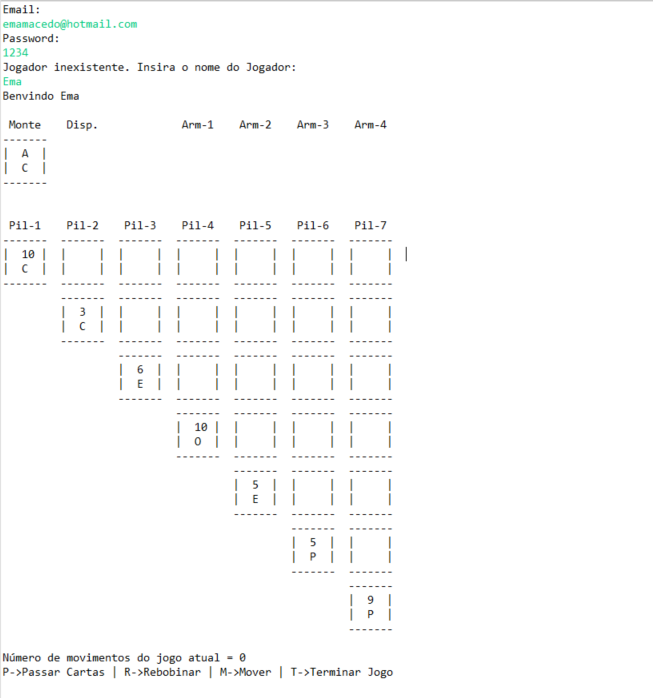
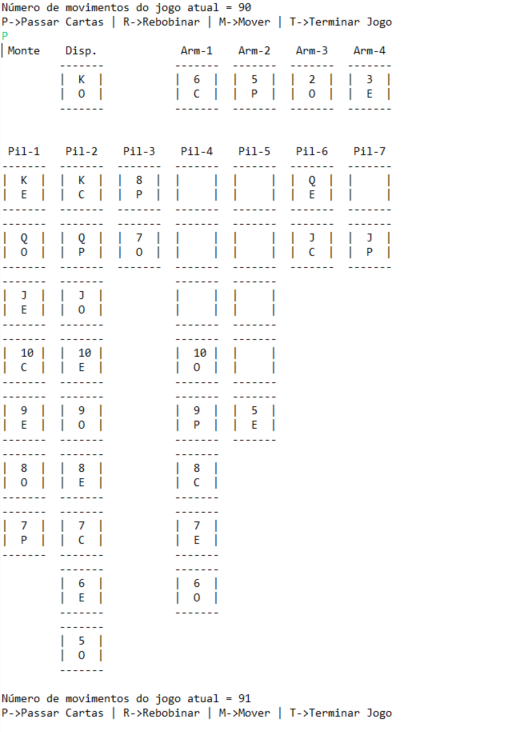
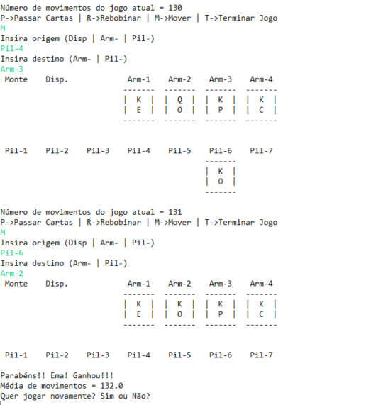

# Solitaire Card Game

A Java implementation of the Solitaire Card Game using Object-Oriented Programming (OOP) concepts. This project was developed for an Informatics Systems class.

The program includes user registration and login functionality as well as the number of moves made in previous games that the user has won.

**Output Examples:**

